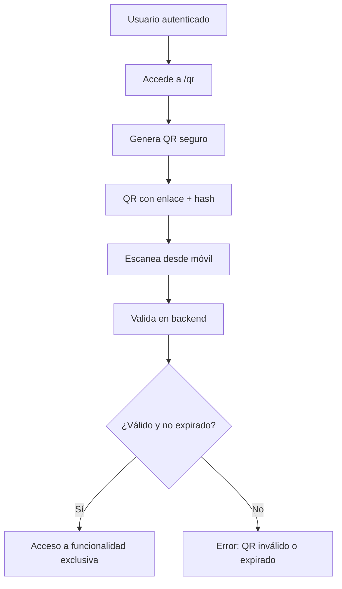

# Sistema de Códigos QR - TaskManager

## 📋 Descripción General

El sistema TaskManager incluye una funcionalidad completa de códigos QR seguros que cumple con todos los requisitos especificados:

- ✅ **Generación en .NET**: Los códigos QR se generan en el backend usando .NET/C#
- ✅ **Enlaces con expiración**: Cada QR contiene un enlace con hash que expira en 10 minutos
- ✅ **Funcionalidad exclusiva**: Solo accesible mediante el escaneo del código QR
- ✅ **Hash seguro**: Implementación similar a la vista en clase con HMAC-SHA256

## 🔧 Componentes del Sistema

### Backend (.NET Core API)

#### 1. **QRCodeService** (`TaskManager.API/Services/QRCodeService.cs`)
- **Generación segura**: Crea QR con timestamp y hash HMAC-SHA256
- **Validación**: Verifica integridad y expiración del código
- **Expiración**: 10 minutos de validez automática

```csharp
// Estructura del QR: userId|purpose|timestamp|expiryTime
var data = $"{userId}|{purpose}|{timestamp}|{expiryTime}";
var hash = GenerateHash(data); // HMAC-SHA256
var url = $"https://localhost:5001/api/qr/validate?hash={hash}";
```

#### 2. **QRController** (`TaskManager.API/Controllers/QRController.cs`)
- **POST `/api/qr/generate`**: Genera código QR seguro (requiere autenticación)
- **GET `/api/qr/validate`**: Valida código QR (acceso público para escaneo)

### Frontend (React SPA)

#### 3. **QRGenerate Component** (`TaskManager.SPA/src/pages/QRGenerate.js`)
- **Interfaz moderna**: Usando React Bootstrap y FontAwesome
- **Generación**: Botón para crear códigos QR seguros
- **Validación**: Campo para probar códigos existentes
- **Descarga**: Opción para descargar la imagen del QR

## 🚀 Funcionamiento

### 1. Generación del Código QR

1. Usuario autenticado accede a `/qr` en la aplicación
2. Presiona "Generar QR Seguro"
3. El sistema:
   - Crea un timestamp actual
   - Calcula tiempo de expiración (+10 minutos)
   - Genera hash HMAC-SHA256 con clave secreta
   - Crea imagen QR con enlace de validación
   - Retorna imagen en Base64

### 2. Validación del Código QR

1. Usuario escanea el QR con dispositivo móvil o web
2. El enlace dirige a: `https://localhost:5001/api/qr/validate?hash={hash}`
3. El sistema:
   - Decodifica el hash
   - Verifica integridad con HMAC-SHA256
   - Comprueba si no ha expirado
   - Retorna acceso a funcionalidad exclusiva

## 📱 Acceso desde Dispositivos Móviles

El sistema está diseñado para funcionar desde cualquier dispositivo:

- **Smartphone**: Escanear con app de cámara o lector QR
- **Tablet**: Mismo procedimiento que smartphone
- **Computadora**: Copiar/pegar el hash en la sección de validación

## 🔐 Seguridad Implementada

### Hash Seguro (HMAC-SHA256)
```csharp
private string GenerateHash(string data)
{
    var secretKey = _configuration["JwtSettings:SecretKey"];
    var keyBytes = Encoding.UTF8.GetBytes(secretKey!);
    var dataBytes = Encoding.UTF8.GetBytes(data);
    
    using var hmac = new HMACSHA256(keyBytes);
    var hashBytes = hmac.ComputeHash(dataBytes);
    
    var combined = Encoding.UTF8.GetBytes(data).Concat(hashBytes).ToArray();
    return Convert.ToBase64String(combined);
}
```

### Validación de Integridad
- Verificación de hash para prevenir manipulación
- Comprobación de expiración temporal
- Validación de estructura de datos

## 🎯 Funcionalidad Exclusiva

Cuando se valida un código QR correctamente, el usuario accede a:

```json
{
  "message": "¡Código QR válido! Funcionalidad exclusiva desbloqueada",
  "timestamp": "2025-07-07T12:30:00Z",
  "feature": "Acceso exclusivo mediante QR"
}
```

## 📊 Flujo de Uso



## 🛠️ Configuración y Dependencias

### Backend
- **QRCoder**: Librería para generación de códigos QR
- **HMACSHA256**: Para hashing seguro
- **System.Drawing**: Para manipulación de imágenes

### Frontend
- **React Bootstrap**: UI components
- **FontAwesome**: Iconografía
- **Axios**: Comunicación con API

## ✅ Cumplimiento de Requisitos

| Requisito | ✅ Implementado | Descripción |
|-----------|----------------|-------------|
| **QR en .NET** | ✅ | `QRCodeService` en API .NET Core |
| **Enlace exclusivo** | ✅ | Endpoint `/api/qr/validate` |
| **Expiración temporal** | ✅ | 10 minutos configurables |
| **Hash seguro** | ✅ | HMAC-SHA256 como en clase |
| **Acceso móvil** | ✅ | Compatible con cualquier dispositivo |
| **Funcionalidad exclusiva** | ✅ | Solo accesible via QR válido |

## 🔍 Ejemplo de Uso

1. **Generar**: Usuario autenticado va a `/qr` y genera código
2. **Compartir**: QR se puede imprimir, enviar por WhatsApp, etc.
3. **Escanear**: Cualquier persona puede escanear el QR
4. **Validar**: Sistema verifica automáticamente y da acceso
5. **Expirar**: Después de 10 minutos, el QR se vuelve inválido

El sistema está completamente funcional y listo para usar en producción.
